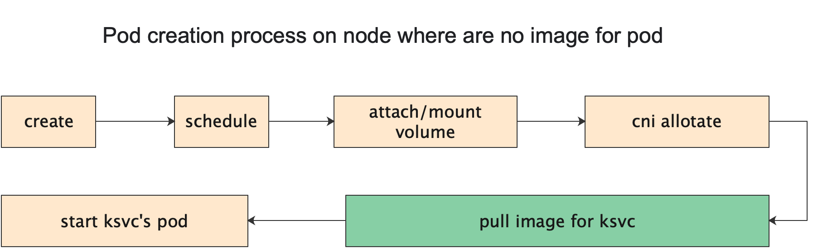
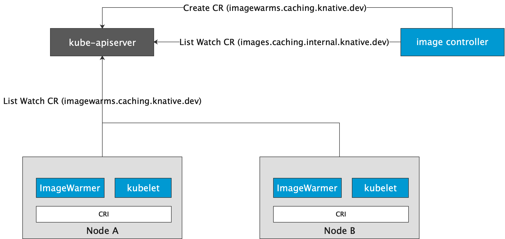

# Cache-Imagewarm

[](https://godoc.org/knative.dev/sample-controller)
[](https://goreportcard.com/report/knative/sample-controller)

## Introduce 

### What and Why
Cache-Imagewarm is designed for reducing the time consumption of cold start. 
It pulls images for every `ksvc`'s `revision` on each Node before **Pod Start**.

And the following figure is the pod creation process on Node where are no image for Pod.



Normally, the process of pulling the image will take a few seconds or more,
This situation（When pods that are automatically expanded by knative are scheduled to nodes where is no image for pod）
often occurs when the number of k8s cluster nodes is large. 
And Using Cache-Imagewarm can avoid the above problems effectively.

### Architecture

It defines a couple of components which are defined to implement image cache.
- imagecontroller: A `Deployment` which will reconcile `imagewarm` resource and reconcile `image`'s status. 
- imagewarmer: A `Daemonset` which will pull image on each node.




**In the early stage of the project, only docker is supported, 
and the subsequent support of crio and containerd**

## API

APIGroup: `caching.knative.dev`, Kind: `ImageWarm`

And here is the `imagewarm` struct:

```go
type ImageWarm struct {
	metav1.TypeMeta `json:",inline"`
	// +optional
	metav1.ObjectMeta `json:"metadata,omitempty"`

	// Spec holds the desired state of the ImageWarm (from the client).
	// +optional
	Spec ImageWarmSpec `json:"spec,omitempty"`

	// Status communicates the observed state of the ImageWarm (from the reconciler).
	// +optional
	Status ImageWarmStatus `json:"status,omitempty"`
}
...
type ImageWarmSpec struct {

	// Image is the name of the container image url to cache across the cluster.
	Image string `json:"image"`

	// NodeName is the names of the node where imagewarmer will pull image.
	NodeName string `json:"nodeName"`

	// ImagePullSecrets contains the names of the Kubernetes Secrets containing login
	// information used by the Pods which will run this container.
	// +optional
	ImagePullSecrets []corev1.LocalObjectReference `json:"imagePullSecrets,omitempty"`
}
...
type ImageWarmStatus struct {
	duckv1.Status `json:",inline"`
}
``` 
